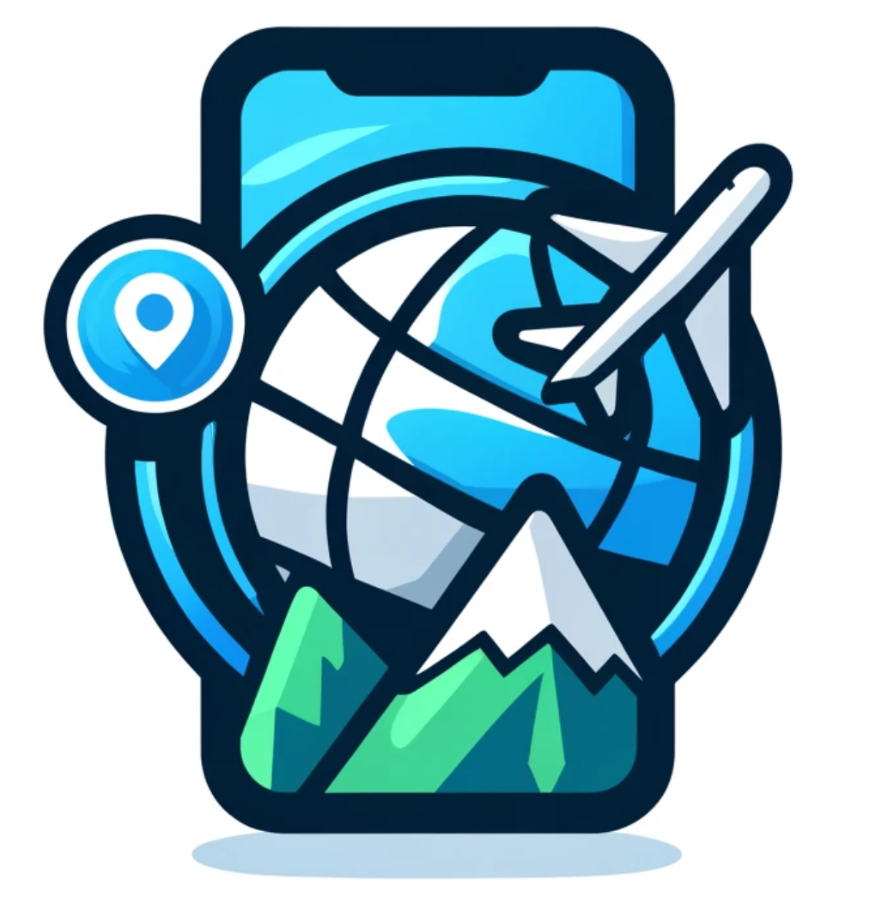

# 软件工程实践项目
## 项目介绍
Wander Pals 是一个网页项目，旨在提供一个旅行助手应用。项目分为前端和后端两部分，前端使用 HTML、CSS 和 JavaScript，后端使用 Flask 框架。
<p align="center">
  
</p>

## 文件夹结构
```
wander-pals/
│
├── backend/                        # 后端代码
│   ├── app.py                      # 主程序
│   ├── models.py                   # 定义数据库模型
│   └── utils.py                    # 定义工具函数（如推荐算法等）
│
├── frontend/                       # 前端代码
│   ├── static/                     # 静态文件（如 CSS、JavaScript、图片等）
│   └── templates/                  # HTML 模板文件
│
├── database/                       # 数据库文件
│   └── traveller_assistant.db      # SQLite 数据库文件
│
├── docs/                           # 实验报告和相关文档
│   ├── lab2/
│   └── lab4/
│
└── README.md

```

## TODO
- [x] 初步设计前端
- [ ] 各页面添加“返回”按钮
- [ ] 推荐算法编写
- [ ] “我的团队”可以查看队员详细信息
- [ ] “团队邀请”查看邀请人和团队详细信息
- [ ] 不是只能在创建团队后才能邀请队员
- [ ] 点击邀请后按钮变灰并显示已邀请
- [ ] 路线规划
  - [x] 高德地图地图显示
  - [ ] 高德地图路线规划
- [ ] 出行小助手
  - [x] 基本功能
  - [ ] Prompt修改